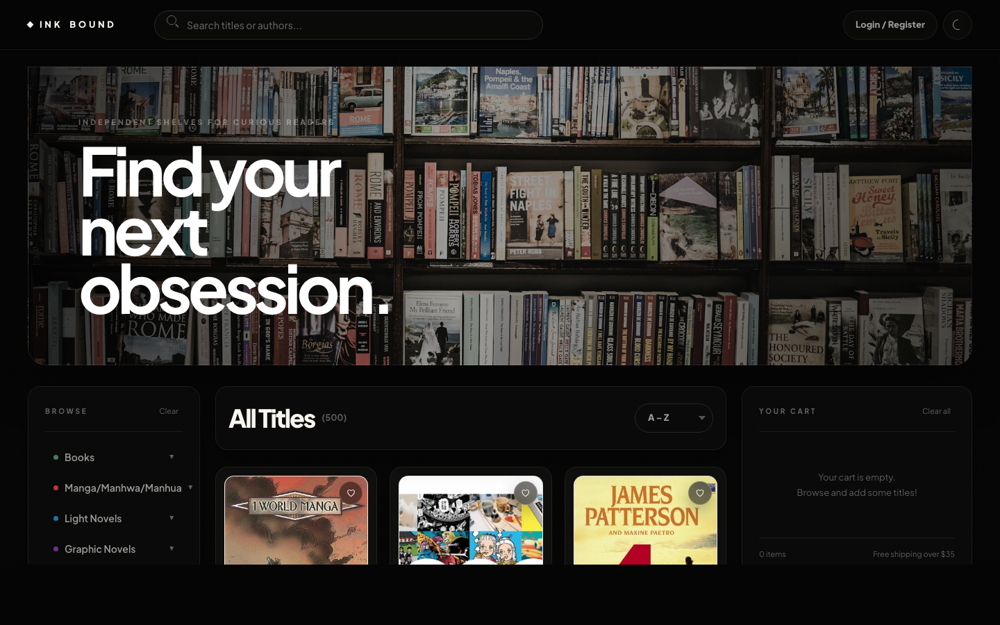

<div align="center">
  
</div>

<br />

# Inkbound — Bookstore

Most online bookstores separate readers into narrow shelves: novels in one place, manga in another, light novels somewhere else, and graphic novels treated like an afterthought. Inkbound solves this by giving every format a single curated storefront with fast search, genre-first browsing, saved carts, order history, and a polished black-and-white luxury interface.

It is a full-stack e-commerce Single Page Application built with a React-enhanced frontend, an Express/MongoDB backend, and a static fallback mode so the storefront still works directly from `frontend/index.html` without running the server.

---

## Tech Stack

| Layer      | Technology                                      |
|------------|-------------------------------------------------|
| Frontend   | React 18, HTML5, CSS3, JavaScript (ES6+)        |
| Backend    | Node.js, Express 4                              |
| Database   | MongoDB Community, native MongoDB Node driver   |
| Auth       | JWT, bcryptjs, role-based admin access          |
| Styling    | Pure CSS with CSS variables design system       |
| Assets     | 500 local Open Library cover images             |
| Offline    | Static catalog + localStorage API fallback      |

---

## Features

- **Luxury storefront UI** — black-and-white Aurum-inspired theme, smooth light/dark transition, minimal header, responsive book grid, premium modal and cart surfaces
- **React dashboard layer** — `react-widgets.js` uses React 18, `useReducer`, `useMemo`, and event-based state sync to render a live store intelligence panel inside the SPA
- **500 unique titles** — real catalog entries with local book cover images, author data, category, genre, price, rating, stock, and description
- **Category browsing** — Books, Manga, Light Novels, and Graphic Novels, each with genre-specific filters
- **Search and autocomplete** — fast title/author search with live suggestions and one-click selection
- **Sorting** — A-Z, price low-high, price high-low, top rated, and newest
- **Product detail modal** — full cover image, category badge, genre, author, rating, description, similar reads, and review area
- **Cart CRUD** — add titles, update quantities, remove individual items, clear all items, and see live subtotal calculations
- **Checkout confirmation** — custom modal confirmation before placing an order, clearing the cart, deleting reviews, or logging out
- **Accounts** — register, log in, persist sessions, user-specific carts, wishlists, and order history
- **Wishlist** — save titles for later and add them to the cart from a side drawer
- **Orders** — checkout creates saved orders, clears the cart, and shows the user’s order history
- **Admin panel** — admin dashboard with all user carts, all orders from every account, product count, order count, users, and revenue
- **CRUD coverage** — users, products, cart items, wishlists, reviews, and orders are created, read, updated, and/or deleted through Express routes and MongoDB collections
- **Static fallback** — when opened via `file://`, `api.js` serves products, users, carts, wishlists, orders, reviews, and admin data from localStorage
- **Accessibility** — labelled inputs, ARIA dialog roles, keyboard Escape handling, focusable product covers, and readable light/dark contrast
- **Responsive** — mobile cart drawer, two-column mobile product cards, adaptive hero, and tablet/desktop grid layouts

---

## Folder Structure

```
fiona2/
├── backend/
│   ├── config/
│   │   ├── db.js                  # Legacy MySQL connection pool
│   │   └── mongo.js               # MongoDB connection helper
│   ├── controllers/
│   │   ├── adminController.js     # Admin user-cart visibility
│   │   ├── authController.js      # Register, login, JWT issue
│   │   ├── cartController.js      # Cart CRUD
│   │   └── productController.js   # Product listing, filters, search
│   ├── middleware/
│   │   └── auth.js                # verifyToken + admin guard
│   ├── models/
│   │   ├── cartModel.js           # Cart SQL helpers
│   │   ├── productModel.js        # Product SQL helpers
│   │   └── userModel.js           # User SQL helpers
│   ├── routes/
│   │   ├── mongoRoutes.js         # Active MongoDB API routes
│   │   ├── adminRoutes.js         # Legacy MySQL analytics/admin routes
│   │   ├── authRoutes.js          # /auth/register, /auth/login, /auth/me
│   │   ├── cartRoutes.js          # /cart CRUD endpoints
│   │   ├── orderRoutes.js         # Checkout + user order history
│   │   ├── productRoutes.js       # Catalog, categories, autocomplete, similar
│   │   ├── reviewRoutes.js        # Product reviews
│   │   └── wishlistRoutes.js      # Wishlist endpoints
│   ├── scripts/
│   │   ├── fetchCovers.js         # Cover download helper
│   │   ├── migrate.js             # Database migration runner
│   │   └── seedBooks*.js          # Seed scripts
│   ├── server.js                  # Express app entry
│   ├── .env.example               # Safe environment template
│   └── package.json
├── database/
│   ├── schema.sql                 # Legacy MySQL schema and seed data
│   ├── catalog_export.json        # Full 500-title JSON export
│   └── migrate_add_auth.sql       # Auth/order-related migration
├── frontend/
│   ├── css/
│   │   └── style.css              # Complete responsive luxury UI system
│   ├── images/
│   │   ├── openlibrary-covers/    # 500 local book cover images
│   │   └── placeholder.svg        # Fallback cover
│   ├── js/
│   │   ├── api.js                 # Backend API client + static fallback API
│   │   ├── app.js                 # App state, event handlers, checkout flow
│   │   ├── catalog.js             # Static 500-title catalog
│   │   ├── react-widgets.js       # React 18 dashboard island
│   │   └── ui.js                  # DOM rendering, modals, admin, confirmations
│   ├── package.json               # React dependency declaration
│   └── index.html                 # Single-page storefront
├── graphify-out/                  # Local code graph output
├── .gitignore
└── README.md
```

---

## Setup Instructions

### Prerequisites
- Node.js 18+
- MongoDB Community running locally

### 1. Install backend dependencies
```bash
cd fiona2/backend
npm install
```

### 2. Configure environment
Copy the example file and replace the placeholders:
```bash
cp backend/.env.example backend/.env
```

### 3. Database setup
MongoDB seeds automatically the first time the backend starts. The app creates the `inkbound` database, loads the 500-book catalog from `database/catalog_export.json`, creates indexes, and inserts the demo admin account.

### 4. Start the backend server
```bash
cd fiona2/backend
npm run dev       # development with nodemon
# or
npm start         # production
```

Server will be available at `http://localhost:3000`.

### 5. Open the frontend
Recommended URL:
```bash
http://localhost:3000
```

You can also open this file directly in a browser:
```bash
fiona2/frontend/index.html
```

When opened directly as a local file, the frontend calls `http://localhost:3000/api` if the MongoDB backend is running. If the backend cannot be reached, it uses the static fallback catalog and localStorage so the demo remains usable.

---

## Demo Accounts

Static fallback mode includes a demo admin account for marking and walkthroughs only:

```text
Email:    admin@inkbound.com
Password: admin123
```

Normal users can be created from the Login / Register modal. Their carts, wishlists, and orders are saved in localStorage when using static mode.

The submitted repository does not track `backend/.env`; real secrets belong only in local environment files.

---

## Assignment Criteria Coverage

| Requirement | Inkbound implementation |
|-------------|-------------------------|
| Modern frontend library | React 18 is used in `frontend/js/react-widgets.js` for the live store dashboard; the rest of the SPA is coordinated through modular JavaScript files. |
| Single-page app behavior | `frontend/index.html` is the only HTML page; the app rewrites views, modals, drawers, filters, admin screens, carts, and orders without page reloads. |
| Backend + database | Node.js/Express routes work with MongoDB collections seeded from `database/catalog_export.json`. |
| User auth | Registration/login use bcrypt password hashing and JWT tokens, with admin role checks in middleware. |
| Live search | The search bar filters the catalog in real time and shows autocomplete suggestions with cover thumbnails. |
| CRUD on at least three entities | Products have admin create/read/update/delete; carts have add/read/update/delete/clear; users have create/read/update/disable; wishlists, reviews, and orders add more database-backed entities. |
| Admin profile/business logic | Admin can view all registered users, current carts, all orders from all accounts, reviews, product inventory, analytics, revenue, and low-stock alerts. |
| Seamless interface | Checkout, confirmations, theme switching, quick view, wishlist, order history, command palette, and admin actions run in-place. |
| Database export | `database/catalog_export.json` contains the full 500-title catalog export; MongoDB also persists live users, carts, wishlists, orders, reviews, and products. |

---

## Workload Allocation

This submission is being completed individually by **Arpit Goyal**.

| Area | Files |
|------|-------|
| Frontend SPA and interaction logic | `frontend/index.html`, `frontend/js/app.js`, `frontend/js/ui.js`, `frontend/js/api.js`, `frontend/js/react-widgets.js` |
| Visual design and responsive UI | `frontend/css/style.css`, `preview.png` |
| Catalog and assets | `frontend/js/catalog.js`, `frontend/images/`, `backend/scripts/fetchCovers.js`, `backend/scripts/seedBooks*.js` |
| Backend/API/database | `backend/server.js`, `backend/routes/mongoRoutes.js`, `backend/config/mongo.js`, `backend/middleware/`, `database/catalog_export.json`, `database/schema.sql`, `database/migrate_add_auth.sql` |
| Documentation/submission material | `README.md`, `.gitignore`, `backend/.env.example` |

---

## Challenges Overcome

**Static API Fallback** — The project originally depended on a running backend, which caused `Failed to fetch` errors when opening `frontend/index.html` directly. I solved this by building a static API layer inside `api.js` that mirrors the backend endpoints for products, auth, carts, wishlists, orders, reviews, and admin data using `localStorage`.

**500 Unique Books with Real Covers** — The first large catalog pass accidentally repeated variants of the same books. The catalog was rebuilt around 500 unique titles and paired with local Open Library cover images so cards display actual book covers instead of random placeholders.

**User-Specific Cart Persistence** — Guest carts and logged-in user carts were initially easy to mix up on the same browser. The session logic now uses deterministic user-specific cart keys once a user is logged in, while guests still get isolated UUID-based sessions.

**Order History and Admin Visibility** — Checkout previously returned success without persisting orders in static mode. Orders are now written to localStorage, user order history reads them back, and the admin panel can view orders across every account.

**Theme Transition Polish** — Light/dark mode originally changed component colors at different times, making the UI feel jarring. The theme toggle now uses the View Transitions API when available, with a CSS fallback that transitions the page as a coherent surface.

**Minimal Luxury UI Pass** — The interface went through several stacked CSS iterations. The final pass added a consistent token system, restrained surfaces, book-focused product cards, custom confirmation dialogs, improved responsive behavior, and an Aurum-inspired black-and-white visual direction.

**Modern Frontend Library Compliance** — The storefront remains a one-page app, but a React 18 dashboard island was added for assignment compliance and technical design discussion. It uses `useReducer` for synchronized app state, `useMemo` for derived catalog metrics, and event listeners to avoid unnecessary full-page rerenders.

---

## Database Export

The MongoDB backend seeds from `database/catalog_export.json`, which contains the full 500-title export. Runtime collections store users, products, carts, wishlists, orders, and reviews in the `inkbound` database.

To export the live MongoDB database for submission or backup:
```bash
mongodump --db inkbound --out database/mongo-dump
```

To restore it later:
```bash
mongorestore --drop --db inkbound database/mongo-dump/inkbound
```
